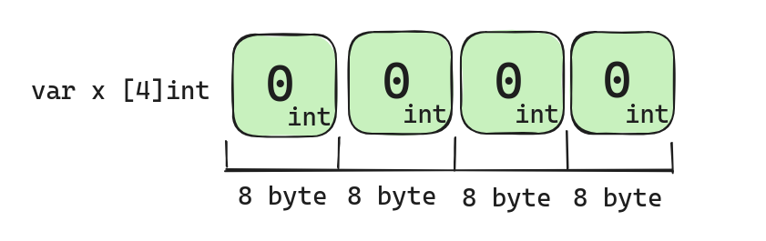
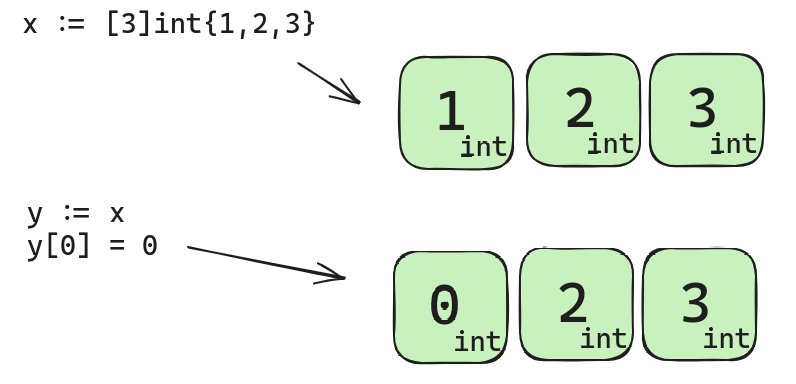
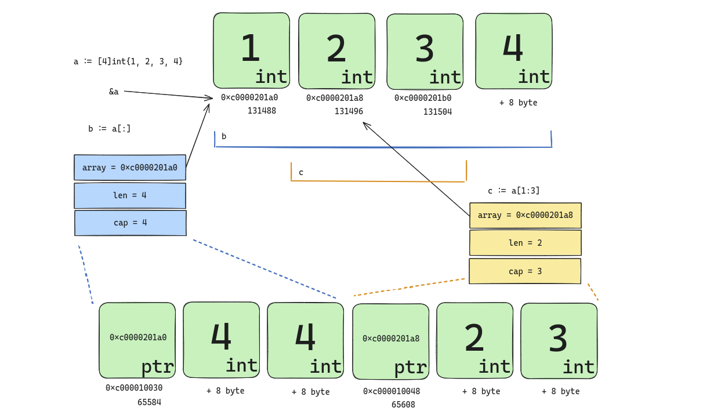
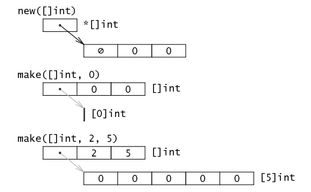
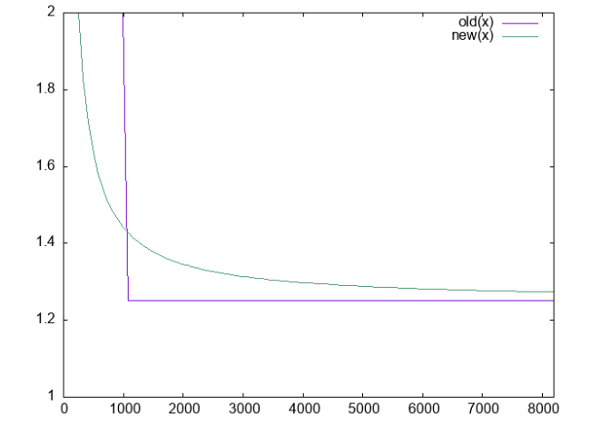

# Arrays

Слайсы это абстракция, построенная поверх массивов, поэтому чтобы понять как устроены слайсы, нужно понять как устроены массивы.

```go
var x [4]int
fmt.Println(x) // [0 0 0 0]
fmt.Println(unsafe.Sizeof(x)) // 32
```



Переменная, которую мы инициализировали со значением массива, содержит именно значения массива, а не ссылку на первый элемент массива.
В определения типа входит и длина и сам тип значений. Таким образом, массивы разной длины или разных типов несовместимы. Ошибку мы получим на этапе компиляции.

```go
var x [4]int
var y [5]int

fmt.Println(x == y) // invalid operation: x == y (mismatched types [4]int and [5]int)

```

Массивы не нужно инициализировать, они инициализируются нулями по умолчанию. Однако есть возможность инициализировать массивы при объявлении и делать это можно несколькими способами.

```go
var x = [4]int{1, 2, 3, 4}
fmt.Println(x) // [1 2 3 4]
```

```go
var x = [5]int{1, 1: 8, 3, 4: 7}
fmt.Println(x) // [1 8 3 0 7]

// Все четыре массива равны [a, b, c]
a := [3]string{"a", "b", "c"}
b := [3]string{0: "a", 1: "b", 2: "c"}
c := [3]string{2: "c", 1: "b", 0: "a"}
d := [3]string{2: "c", 0: "a", "b"}
```

```go
x := [...]int{4: 0}
fmt.Println(x) // [0 0 0 0 0]
```

Длина массива должна быть константой, т.е быть известна на этапе компиляции, поэтому вот такое объявление не пройдет.

```go
var x [get10()]int // array length get10() (value of type int) must be constant

func get10() int {
    return 10
}
```

И так тоже, тут даже 2 ошибки на этапе компиляции.
```go
var y int = 10 // y declared and not used
var arr2 [y]int // invalid array length y

// А вот так можно
const i = 10
var arr1 [i]int // ok
```

Массивы это значения, поэтому при присваивании к новой переменной массив копируется целиком.

```go
x := [3]int{1, 2, 3}
y := x
y[0] = 0
fmt.Println(x) // [1 2 3]
fmt.Println(y) // [0 2 3]
```



Длина и емкость массива никогда не могут измениться и всегда равны длине типа массива.

```go
var x [3]int
fmt.Println(len(x), cap(x)) // 3 3
```

[Создание](https://go.dev/src/runtime/malloc.go#L1342) массива под капотом это по сути выделение памяти заданного размера.
```go
// https://go.dev/src/runtime/malloc.go#L1342
// newarray allocates an array of n elements of type typ.
func newarray(typ *_type, n int) unsafe.Pointer {
	if n == 1 {
		return mallocgc(typ.Size_, typ, true)
	}
	mem, overflow := math.MulUintptr(typ.Size_, uintptr(n))
	if overflow || mem > maxAlloc || n < 0 {
		panic(plainError("runtime: allocation size out of range"))
	}
	return mallocgc(mem, typ, true)
}
```

# Slice

Слайс или Срез это структура данных, которая содержит указатель на массив, длину и емкость. Срезы всегда указывают на массив, и никогда сами по себе не являются массивами. Срезы всегда имеют длину, которая может изменяться во время выполнения. Емкость среза может изменяться во время выполнения. Срезы гораздо более гибки, чем массивы, и используются на практике чаще, чем массивы.

```go
// https://go.dev/src/runtime/slice.go#L15
type slice struct {
	array unsafe.Pointer
	len   int
	cap   int
}
```

Размер слайса в памяти всегда 24 байта
```go
a := []int{1, 2, 3, 4, 5}
fmt.Println(unsafe.Sizeof(a)) // 24
```
А вот так выглядит sliceHeader в рантайме
```go
a := []int{1, 2, 3}
header := (*reflect.SliceHeader)(unsafe.Pointer(&a))
fmt.Println(header) // &{824634916864 3 3}
fmt.Println(reflect.TypeOf(a)) // []int
fmt.Println(reflect.TypeOf(header)) // *reflect.SliceHeader
```


Поскольку срезы являются "указателями на массивы", то при присваивании среза другой переменной, копируется только сама структура среза, а не подкапотный массив. Тем самым не происходит дополнительной аллокации памяти.

```go
a := [4]int{1, 2, 3, 4}
b := a[:]
c := a[1:3]
fmt.Printf("ptr: %p, len: %d, cap: %d\n", &a, len(a), cap(a))
fmt.Printf("ptr: %p, len: %d, cap: %d\n", b, len(b), cap(b))
fmt.Printf("ptr: %p, len: %d, cap: %d\n", c, len(c), cap(c))

// a ptr: 0xc0000201a0, len: 4, cap: 4
// b ptr: 0xc0000201a0, len: 4, cap: 4 &b ptr: 0xc000010030
// c ptr: 0xc0000201a8, len: 2, cap: 3 &c ptr: 0xc000010048
```



#### Отличия `new` и `make` для слайсов  


#### Копирование 
В языке есть встроенная функция `copy`, позволяющая выполнять неглубокое копирование.
```go
a := []int{1, 2, 3}
b := make([]int, len(a))
copy(b, a)
```

```go
// slicecopy is used to copy from a string or slice of pointerless elements into a slice.
func slicecopy(toPtr unsafe.Pointer, toLen int, fromPtr unsafe.Pointer, fromLen int, width uintptr) int {
	// упрощенно
	n := fromLen
	if toLen < n {
		n = toLen
	}
	
	size := uintptr(n) * width
	memmove(toPtr, fromPtr, size) // memmove copies n bytes from "from" to "to".
	
	return n
}

```

#### Слайс any
Мы можем присвоить значение любого типа в переменную с типом `any`. Но не можем присвоить слайс в `[]any`
```go
func printSliceAny(a []any) {
    for i, v := range a {
        fmt.Println(i, v)
    }   
}
// Это будет работать
a := []any{1, "two"}
printSliceAny(a)
	
b := []int{} // Cannot use 'b' (type []int) as the type []any
printSliceAny(b)
```

#### Передача среза в метод 
Важно понимать, что хотя срез и содержит указатель, сам по себе он является значением. Это не указатель на структуру. И как и всё в go он передается по значению.
```go

// изменит переданный срез, а точнее значения подкапотного массива
func addOne(slice []int) {
    for i := range slice {
        slice[i]++
    }
}

// никак не повляет на входящий аргумент, но вернет новый sliceHeader
func delLast(slice []int) []int {
    slice = slice[0 : len(slice)-1]
    return slice
}

// если передать указатель, то sliceHeader изменится
func ptrDelLast(slicePtr *[]int) {
    slice := *slicePtr
    *slicePtr = slice[0 : len(slice)-1]
}

```

#### Append

[Принцип](https://go-review.googlesource.com/c/go/+/347917) роста `cap` поменяли в 1.18. 
Если опускать подробности, раньше коэф. увеличения вместимости был равен `x2.0` до 1024 элементов, потом он устанавливался в `х1.25`.
Теперь коэф. равен `x2.0` до размера в 256 элементов, а потом происходит его плавное уменьшение до `х1.25`. Это делает рост `cap` более монотонным. 


#### Слайсы байт и строки
У строки как у неизменяемой последовательности `byte` схожий со слайсом header
```go
// https://go.dev/src/reflect/value.go#L2775
type StringHeader struct {
    Data uintptr
    Len  int
}

type SliceHeader struct {
    Data uintptr
    Len  int
    Cap  int
}
```
Но если очень нужно можно поменять значение строки без аллокаций.
```go
a := []byte("hello")
b := string(a) // это аллокация новой памяти под массив байт
fmt.Println(a, b) // [104 101 108 108 111] hello

c := *(*string)(unsafe.Pointer(&a))
a[0] = '_'
fmt.Println(a, b, c) // [95 101 108 108 111] hello _ello
```

#### Конкурентность

Слайсы не потокобезопасны, если необходимо нужно обкладывать мьютексами
```go
a := make([]int, 10)

for _ = range a {
    go func() {
	for i := range a {
	    a[i] += 1
        }
    }()
}
time.Sleep(1 * time.Second)

// go run -race main.go 
// 
//==================
//WARNING: DATA RACE
// Read at 0x00c00011e000 by goroutine 10:


// Но если горутины не пересекаются гонки не будет
a := make([]int, 10)

for x := range a {
  go func(x int) {
    a[x] += 1
  }(x)
}
time.Sleep(1 * time.Second)

//fmt.Println(a) в таких тестах надо быть аккуратнее с выводом на экран - это уже будет гонка.

```

#### Утечки памяти

```go
func last_leak(s []int) []int {
    return s[len(s)-5:]
}

func last_good(s []int) []int {
    r := make([]int, 5)
	copy(r, s[len(s)-5:])
    return r
}
```

#### Задачи на самостоятельную проработку

1. Написать свою упрощенную реализацию `Append()` с использованием дженериков, которая всегда увеличивает размер `cap` вдвое при превышении.
2. Реализовать метод, позволяющий увеличить текущую `cap` переданного слайса до требуемой.
3. Реализовать метод, позволяющий объединить произвольное количество слайсов в один.


#### Полезные ссылки:

- https://go.dev/blog/slices-intro
- https://go.dev/blog/slices
- https://go.dev/doc/effective_go#arrays
- https://go.dev/wiki/SliceTricks
- https://go.dev/wiki/InterfaceSlice
- https://go101.org/article/container.html
- https://go101.org/article/memory-leaking.html
- https://www.youtube.com/watch?v=pHl9r3B2DFI
- https://www.youtube.com/watch?v=10LW7NROfOQ
- https://www.youtube.com/watch?v=T0Xymg0_aSU
- https://go-review.googlesource.com/c/go/+/347917
- https://rostislaved.medium.com/изменения-функции-append-в-go-1-18-с-графиками-3c0bc758d075
- https://tour.ardanlabs.com/tour/eng/slices/1
- https://research.swtch.com/godata
- https://www.dolthub.com/blog/2023-10-20-golang-pitfalls-3/
- https://blogtitle.github.io/go-slices-gotchas/
- https://www.ardanlabs.com/blog/2023/07/getting-friendly-with-cpu-caches.html
- https://habr.com/ru/companies/vk/articles/510200/
